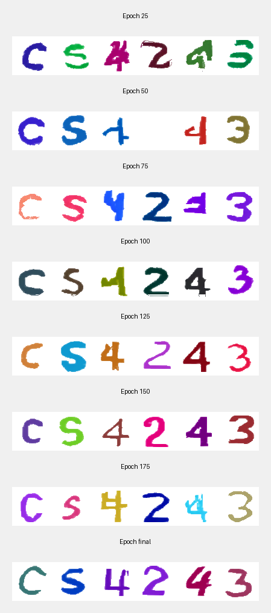

# CAPTCHA Character Recognition

A deep learning project for recognizing alphanumeric characters in CAPTCHA images using CNNs.

## Features

- Preprocessing pipeline with hairline removal
- Color-based tokenization for character segmentation
- CNN-based character recognition (91.73% accuracy)
- GPU acceleration support (CUDA)

## Project Structure

```
├── model_structure.py              # CNN architecture definition
├── model_trainer.py                # Training script
├── model_result_visualizer.py      # Evaluation and visualization
├── visualize_tokenization_pipeline.py  # Pipeline visualization
├── preprocessing/
│   └── hairline_removal.py        # Image preprocessing
├── tokenization/
│   └── color_region_tokenizer.py  # Character segmentation
└── data/
    ├── raw/train/                 # Training images
    └── raw/test/                  # Test images
```

## Development Setup

### Prerequisites

- Python 3.12+
- [uv](https://github.com/astral-sh/uv) (Python package manager)

### Installation

1. Clone the repository
2. Install dependencies based on your platform:

**Windows (with NVIDIA GPU):**
```bash
uv sync --extra cu121
# or cu129, depending on your GPU
```

**Mac/Linux (CPU only):**
```bash
uv sync --extra cpu
```

## Usage

### 1. Train the Model

```bash
uv run python -m src.recognition.model_trainer
```

This will:
- Load CAPTCHA images from `data/raw/train/`
- Apply preprocessing and tokenization
- Train for 50 epochs
- Save the best models to `checkpoints/character_cnn/*.pth`

**Training time**: ~15 minutes on RTX 4060 Laptop GPU

### 2. Evaluate the Model

```bash
uv run python -m src.recognition.model_evaluator
```

This will:
- Test the model on random CAPTCHA images
- Display predictions vs ground truth
- Calculate accuracy metrics

## Model Performance

- **Character-level accuracy**: 91.73%
- **Architecture**: 4-layer CNN with 2.5M parameters
- **Classes**: 36 (0-9, A-Z)
- **Input**: 32x32 grayscale character images

### Results



## Data Format

Training images should be named: `{label}-{index}.png`

Example: `ed57g-0.png` means the CAPTCHA text is "ed57g"

## Model Weights

**Important**: Model weights (`.pth` files) are NOT committed to git.

Each team member should:
1. Train their own model using `model_trainer.py`, OR
2. Download pre-trained weights from [releases/shared drive]

## Cross-Platform Notes

- The code handles path differences automatically using `pathlib.Path`

## Requirements

See `pyproject.toml` for full dependency list

## License

MIT

